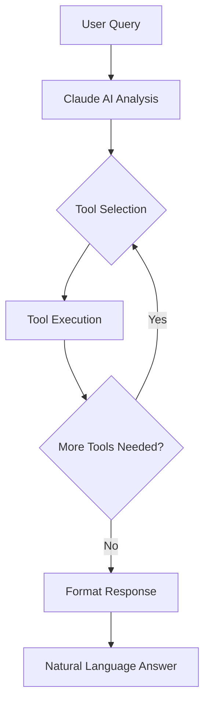

# Claude AI Chat Tools

This directory contains the AI tool system for interacting with BIM models through natural language queries.

## 🏗️ Architecture Overview

The system follows a tool-based architecture where:
1. User queries are analyzed by Claude AI
2. Claude selects appropriate tools to execute
3. Tools interact with the BIM model data
4. Results are formatted into natural language responses

## 📦 Core Components

### Tool Registry (`tool-registry.ts`)
- Central registry for all available tools
- Type-safe tool registration and retrieval
- Validates tool parameters before execution

### Tool Chain Executors

#### `tool-chain-executor.ts`
- Base executor for running tool chains
- Handles iterative tool execution
- Manages context between tool calls

#### `improved-tool-chain-executor.ts`
- Enhanced version with better error handling
- Supports retry logic for failed tool calls
- Includes thought process tracking

#### `smart-chunks-tool-chain-executor.ts`
- Extends improved executor with Smart Chunks integration
- Automatically fetches relevant context based on query
- Optimizes token usage by loading only necessary data

## 🛠️ Available Tools

### 1. **Universal Search Tool** (`bim-universal-search-tool.ts`)
Unified search functionality for BIM entities.

**Features:**
- Search by type, name, or properties
- Count entities matching criteria
- Progressive loading for large results
- Full-text search capabilities

**Parameters:**
```typescript
{
  query?: string,           // Text to search
  types?: string[],         // IFC types (e.g., ["IFCWALL", "IFCDOOR"])
  countOnly?: boolean,      // Return only count
  progressive?: boolean,    // Use chunk-based loading
  limit?: number,          // Max results (default: 100)
  offset?: number          // Pagination offset
}
```

**Example Use Cases:**
- "Show all walls" → Searches for type IFCWALL
- "Count doors on floor 2" → Counts with spatial filter
- "Find pump" → Text search across all entities

### 2. **Entity Detail Tool** (`bim-entity-detail-tool.ts`)
Get comprehensive information about specific entities.

**Features:**
- Retrieve all properties of an entity
- Include geometric data
- Show relationships to other entities

**Parameters:**
```typescript
{
  expressId: number,              // Required: Entity ID
  includeProperties?: boolean,    // Include all IFC properties
  includeGeometry?: boolean,      // Include geometric data
  includeRelationships?: boolean  // Include related entities
}
```

**Example Use Cases:**
- "Show details of entity 12345"
- "What are the properties of this wall?"

### 3. **Type List Tool** (`bim-type-list-tool.ts`)
Lists all available entity types in the model.

**Features:**
- Shows all IFC types present
- Includes count per type
- Provides example entities

**Parameters:**
```typescript
{
  limit?: number,        // Max types to return
  includeExamples?: boolean  // Include sample entities
}
```

**Example Use Cases:**
- "What types of elements are in this model?"
- "List all entity types"

### 4. **Spatial & Geometry Tool** (`bim-spatial-geometry-tool.ts`)
Analyzes spatial and geometric properties.

**Features:**
- Calculate volumes, areas, dimensions
- Find entities in spatial regions
- Proximity searches
- Bounding box queries

**Parameters:**
```typescript
{
  operation: 'volume' | 'area' | 'bounds' | 'near' | 'within',
  entityIds?: number[],     // For specific entities
  region?: {                // For spatial queries
    min: [x, y, z],
    max: [x, y, z]
  },
  nearPoint?: { x, y, z },  // For proximity search
  radius?: number           // Search radius
}
```

**Example Use Cases:**
- "Calculate total volume of all walls"
- "Find entities near point (10, 20, 0)"
- "What's in the north wing?"

### 5. **Highlight Tool** (`bim-highlight-tool.ts`)
Controls entity highlighting in the 3D viewer.

**Features:**
- Highlight multiple entities
- Clear existing highlights
- Visual feedback for queries

**Parameters:**
```typescript
{
  entityIds: number[],      // Required: IDs to highlight
  color?: string,           // Highlight color (hex)
  clear?: boolean          // Clear before highlighting
}
```

**Example Use Cases:**
- After any search: highlights found entities
- "Highlight all doors" → Visual feedback
- "Clear highlights" → Reset view

### 6. **Chunk Management Tool** (`bim-chunk-management-tool.ts`)
Manages the Smart Chunks system performance.

**Features:**
- View chunk statistics
- Analyze memory usage
- Optimize chunk distribution

**Parameters:**
```typescript
{
  operation: 'status' | 'analyze' | 'optimize',
  chunkId?: string         // For specific chunk analysis
}
```

**Example Use Cases:**
- "Show chunk system status"
- "Optimize memory usage"

### 7. **Selection Context Tool** (`bim-selection-context-tool.ts`)
Gets context about currently selected/highlighted entities.

**Features:**
- Summary of selected entities
- Aggregate properties
- Spatial distribution

**Parameters:** None (operates on current selection)

**Example Use Cases:**
- "What's currently selected?"
- "Summarize highlighted entities"

## 🔄 Tool Execution Flow



## 💡 Smart Chunks Integration

When Smart Chunks is enabled:

1. **Query Analysis**: Extracts entity types and keywords from the query
2. **Context Selection**: Loads only relevant chunks based on query
3. **Token Optimization**: Stays within LLM token limits
4. **Performance**: Faster responses by reducing data processing

## 🎯 Usage Examples

### Simple Query
```
User: "How many doors are there?"
AI: Uses bim_universal_search with types=["IFCDOOR"], countOnly=true
Response: "There are 45 doors in the model."
```

### Complex Query with Multiple Tools
```
User: "Show all walls on the second floor and calculate their total volume"
AI: 
1. Uses bim_universal_search with types=["IFCWALL"], spatial filter
2. Uses bim_spatial_geometry with operation="volume"
3. Uses bim_highlight to visualize results
Response: "Found 23 walls on the second floor with a total volume of 145.3 m³. 
           The walls are now highlighted in green."
```

### Smart Chunks Example
```
User: "Find all pumps in the mechanical room"
Smart Chunks: Loads only chunks containing mechanical equipment
AI: Uses bim_universal_search with optimized context
Response: "Found 3 pumps in the mechanical room: ..."
```

## 🛡️ Error Handling

All tools include:
- Parameter validation
- Graceful error handling
- Meaningful error messages
- Fallback strategies

## 🔧 Extending the System

To add a new tool:

1. Create tool file following the pattern:
```typescript
export const createMyTool = (dependencies): Tool => ({
  name: 'my_tool',
  description: 'What this tool does',
  parameters: { /* JSON Schema */ },
  execute: async (params) => { /* Implementation */ }
});
```

2. Register in `index.ts`
3. Update tool count in documentation

## 📊 Performance Considerations

- Tools are designed to be fast (<100ms typical)
- Smart Chunks reduces data processing by 60-80%
- Caching prevents redundant calculations
- Progressive loading for large datasets

## 🤝 Best Practices

1. **Tool Selection**: Let Claude AI choose tools based on query
2. **Context Preservation**: Maintain context between tool calls
3. **Error Messages**: Provide user-friendly error explanations
4. **Visual Feedback**: Use highlighting for spatial queries
5. **Performance**: Use Smart Chunks for large models